# RTOS Master Map — Flyme XR 1.0.12.83 (BEST1600)

**Firmware bundle:** `Reverse/firmware/x_1.0.12.83/`  
**Integration leaf:** leaf-2.1 (unlazy RTOS pipeline)  
**Machine index:** [`manifest.json`](manifest.json)

This document integrates five verified leaf analyses into a single cross-core RTOS map for the Star Air smart-glasses SoC. Three independent schedulers coexist: **FreeRTOS** on the M55 application core, **RTX5** on the BTH Bluetooth M33, and **RTX5** on the carved Sensor Hub sub-image. Cross-core traffic uses BES INTERSYS mailboxes, MCU↔sensor channels, and RPC/core-bridge mailboxes.

---

## 1. Executive summary

### Three kernels, one product

| Core / image | CPU | Kernel | Version | Static threads | Static IPC |
|---|---|---|---|---:|---:|
| **M55** (`platform_tester.bin`, 6.7 MB) | Cortex-M55 | **FreeRTOS** + CMSIS-RTOS2 | V10.4.1 | **60** | **133** |
| **BTH** (`best1600_watch_bth.bin`, 1.3 MB) | Cortex-M33 | **RTX5** | V5.5.1 | **16** | (via INTERSYS/RPC strings) |
| **Sensor Hub** (carve @ `0x134070` in M55 blob) | Cortex-M33 (hub) | **RTX5** | V5.5.1 | **6** | **14** RTOS objects |

Additional FreeRTOS instance runs on **HiFi4 DSP** (Xtensa port strings in M55 image; not separately carved). M55 main firmware is FreeRTOS; RTX5 dump code (`rtx_thread_dump.c`) is embedded for shared BES introspection, not because M55 runs RTX5 as its primary scheduler.

### What is recoverable statically

| Category | Recoverable offline | Requires on-device |
|---|---|---|
| Thread **names** | ✓ string scan (`*_thread`, create-failure logs) | — |
| Thread **entry VAs** | Partial (8 high-confidence on M55; BTH has string VAs only) | `dump_all_threads` → `thread_addr` |
| IPC object **names/types** | ✓ named strings + failure logs | Handle IDs in `.bss` |
| Kernel **version** | ✓ banner strings | — |
| Runtime **TCB walk** | Format strings only | `dump_all_threads` via eshell |
| **Complete** thread list | Static lists are lower bounds | eshell on M55 or BTH UART / `debug_i2c` |
| Sensor hub **extent** | High confidence start; medium on 1 MiB tail | Hub ping / `sensor_hub_open` logs |

### Leaf documents (detail)

| Leaf | Path | Focus |
|---|---|---|
| 1.1.1 M55 threads | [`m55/THREADS.md`](m55/THREADS.md) | 60 FreeRTOS tasks by subsystem |
| 1.1.2 M55 IPC | [`m55/IPC_OBJECTS.md`](m55/IPC_OBJECTS.md) | 133 CMSIS-RTOS2 objects + flow diagrams |
| 1.2.1 BTH RTX5 | [`bth/RTX5_MAP.md`](bth/RTX5_MAP.md) | 16 RTX5 threads, INTERSYS |
| 1.2.2 Sensor Hub | [`sensor_hub/SENSOR_HUB_RTOS.md`](sensor_hub/SENSOR_HUB_RTOS.md) | Carve, 6 hub threads, M55↔hub IPC |
| 1.3.1 Introspection | [`introspection/INTROSPECTION.md`](introspection/INTROSPECTION.md) | eshell commands, TCB layout |

---

## 2. FreeRTOS (M55)

**Image:** `platform_tester.bin` · **Thumb text:** `VA = file + 0x2C010000` · **Named-object / TRACE alias:** `VA = file + 0x3BFD7C0C` (runtime window `0x3C……`)  
*(Older notes used plain XIP `0x2C000000` for code; that base is **0x10000 too low** for runtime Thumb pointers — see [`lvgl/LVGL_THREAD.md`](lvgl/LVGL_THREAD.md).)*  
**Evidence:** `FreeRTOS V10.4.1` @ `0x12BECC`, CMSIS-RTOS2 shim @ `0x12BE5D`  
**Inventory:** [`m55/thread_inventory.json`](m55/thread_inventory.json) · [`m55/ipc_inventory.json`](m55/ipc_inventory.json)

### Thread count by subsystem

| Subsystem | Count | Role |
|---:|---|---|
| **ble** | 21 | StarryNet phone link, core bridge, BTH IF client, RPC, DSP relay |
| **audio** | 9 | Audioflinger, local decode, A2DP sink, MCPP/HiFi4 RPC |
| **display** | 8 | JBD µLED panel, LVGL handler + async bridge, touch job |
| **sensors** | 5 | SAR (STK5115), STK501xx wear, M55-side temple touch variants |
| **shell** | 3 | eshell UART, restart helper, after-sale log test |
| **dsp** | 2 | `m55_dsp_{rx,tx}_thread_run` — HiFi4 mailbox pump |
| **power** | 2 | `xrbm_thread` battery/wear manager |
| **touch** | 2 | STK touch algorithm workers |
| **factory** | 1 | `fac_cmd_trd` — factory UART dispatch |
| **other** | 3 | OTA checker, StarryNet trace, I²C SM tasks |
| **Total** | **60** | |

### High-confidence entry VAs (8)

| Thread | Entry VA | Method |
|---|---|---|
| `jbd4010_display` | `0x2C4A9270` | Packed entry word @ file `0x4258c` (`0x2C4A9271`); file `0x499270` + text base |
| `xrbm_thread` | `0x2C489D94` | Power reconstruction |
| `af_thread` | `0x2C14D89E` | Ghidra |
| `sar_thread` | `0x2C527B00` | Literal pool scan |
| `aslt_thread` | `0x2C306EFA` | Literal pool scan |
| `xrbm` (init helper) | `0x2C463FDD` | Literal pool near create log |
| `lvgl_ui` | `0x2C63F228` | TRACE + `osThreadAttr_t` + Capstone loop ([`lvgl/LVGL_THREAD.md`](lvgl/LVGL_THREAD.md)) |
| `lvgl_async` | `0x2C63F0D8` | TRACE + `osThreadAttr_t` + Capstone loop ([`lvgl/LVGL_THREAD.md`](lvgl/LVGL_THREAD.md)) |

`lvgl_ui` is the CMSIS thread name behind the TRACE string `lvgl_task_handler_thread`. Remaining threads are **name-only** due to PIC + TRACE interning (see §7).

### Representative M55 threads

| Name | Subsystem | Source path | Notes |
|---|---|---|---|
| `starrynet_rx_msg_thread` | ble | `message_manager.c` | Phone RX mailbox consumer |
| `starrynet_tx_msg_thread` | ble | `message_manager.c` | Phone TX mailbox producer |
| `core_bridge_{rx,tx}_thread` | ble | `corebridge/` | Cross-core RPC pump |
| `bth_if_client_thread` | ble | `bth_if_thread_client.c` | M55→BTH IF client |
| `rpc_rx_thread` | ble | `rpc_rx_thread.c` | Generic RPC RX |
| `jbd4010_display` | display | `panel_driver.c` | SPI µLED worker |
| `lvgl_ui` | display | `lv_app.c` | Main LVGL / task-handler loop (`lvgl_task_handler_thread` TRACE) |
| `lvgl_async` | display | `lv_async_handler_thread.c` | Async UI IPC bridge |
| `af_thread` | audio | `af_stream_sw_gain.c` | DMA/stream pump |
| `mcpp_srv_thread` | audio | `mcpp_core_hifi.c` | HiFi4 MCPP server |
| `m55_dsp_{rx,tx}_thread*` | dsp | `rpc_m55_dsp.c` | M55↔HiFi4 RPC |
| `xrbm_thread` | power | `wear_detection.cpp` | Battery + wear policy |
| `eshell_thread` | shell | `eshell_platform.c` | UART console |
| `fac_cmd_trd` | factory | `fac_cmd_mmi.c` | Factory command worker |

Full per-entry table: [`m55/THREADS.md`](m55/THREADS.md).

### Top IPC flows (133 objects)

**By type:** timer 48 · mutex 47 · mailbox 15 · semaphore 9 · memory_pool 4 · event_flags 4 · message_queue 4 · other 2

**By subsystem:** other 36 · starrynet 20 · sensor 18 · battery/xrbm 13 · audio 12 · touch 10 · display 9 · dsp 6 · shell 4 · lvgl 3 · factory 2

#### Display path (JBD + LVGL)

```
lvgl_async / UI ──► lv_ipc_mailbox ──► jbd4010_display
                 └► lv_to_async_ipc_mailbox ──┘
GPU blit ──► jbd_mailbox
JBD_TIMER (watchdog) ──► jbd4010_display
display_frame_mutex, display_mgr_mutex ── serialize panel access
```

Key objects: `jbd_mailbox`, `lv_ipc_mailbox`, `lv_to_async_ipc_mailbox`, `JBD_TIMER`, `display_frame_mutex`.

#### StarryNet phone link

```
BT/GATT/SPP ──► rx_msg_mailbox ──► starrynet_rx_msg_thread
starrynet_tx_msg_thread ──► tx_msg_mailbox ──► BT
msg_send_list_mutex, msg_emergency_list_mutex ── list protection
CHANNEL_*_WAIT_MSG_ACK_TIMER, SPP_CNANNEL_*_TIMER ── timeouts
```

#### Sensor hub bridge (M55 side)

```
sensor_main / init_xr_m55_sensor_mgr
  ├── xjxr_ms_mutex (serializes bridge sends @ 0x2C526A40)
  ├── xjxr_ag_mutex, xjxr_sensor_mutex
  ├── sar_mailbox (+ variant mailboxes per STK part)
  └── sensor_hub_ping_mcu_timer ── hub ready handshake
```

Channels: **`xjxr_m552sns`** (M55→hub), **`xjxr_sns2m55`** (hub→M55) — see §4.

#### Battery manager (xrbm)

```
fuel gauge / charger ──► xrbm_thread ◄── xrbm_mailbox
battery_mgr_mutex, battery_info_timer, power_state_mutex
Messages: USB plug (0x20), SOC refresh (0x40)
```

#### Cross-core RPC (M55 side)

| Mailbox / mutex | Threads |
|---|---|
| `app_core_bridge_tx_mailbox` | `core_bridge_{tx,rx}_thread` |
| `bth_if_client_mailbox` | `bth_if_client_thread` |
| `rpc_rx_mailbox` | `rpc_rx_thread`, `bth_dsp_tx_thread` |
| `mcpp_cmd_sema` | `mcpp_srv_thread` |

Full subsystem tables and mermaid diagrams: [`m55/IPC_OBJECTS.md`](m55/IPC_OBJECTS.md).

---

## 3. RTX5 (BTH M33)

**Image:** `best1600_watch_bth.bin` · **Load base:** `0x14000000` · **Size:** 1,341,116 B  
**Kernel:** RTX5 **V5.5.1** · **Subsys:** `CHIP_SUBSYS=bth`  
**Inventory:** [`bth/rtx5_inventory.json`](bth/rtx5_inventory.json) · Detail: [`bth/RTX5_MAP.md`](bth/RTX5_MAP.md)

### 16 threads by category

| Category | Count | Threads |
|---|---:|---|
| **bt_stack** | 6 | `app_bt_cmd_thread`, `hci_rx_thread`, `bth_if_thread`, `APPTHREAD`, `BesbtThread` |
| **audio** | 3 | `af_thread`, `xjxr_audio_event_thread`, `xjxr_audio_msg_handler_thread` |
| **audio_dsp** | 1 | `bth_dsp_tx_thread` |
| **shell** | 3 | `eshell_thread...`, `eshell_rpc_rx_thread`, `restart_eshell_thread` |
| **rpc_ipc** | 1 | `rpc_rx_thread` |
| **app_main** | 1 | `app_thread` |
| **ota** | 1 | `ota_thread` |
| **intersys** | 1 | `intersys_tx_thread_id` (logged handle, not a name string) |

### Thread table

| Thread | Category | Source hint | String VA |
|---|---|---|---|
| `app_thread` | app_main | `app_thread.c` | `0x1413805C` |
| `app_bt_cmd_thread` | bt_stack | `app_bt_cmd.cpp` | `0x1411623C` |
| `hci_rx_thread` | bt_stack | HCI RX ISR path | `0x1411EFB4` |
| `bth_if_thread` | bt_stack | `bth_if_thread_server.c` | `0x14130DC8` |
| `APPTHREAD` | bt_stack | BT app mode label | `0x140E6688` |
| `BesbtThread` | bt_stack | Main BT stack | `0x1411A7A0` |
| `af_thread` | audio | Audioflinger | `0x1412CCCC` |
| `xjxr_audio_event_thread` | audio | XJXR audio events | `0x1411AB5C` |
| `xjxr_audio_msg_handler_thread` | audio | Multi-core audio msgs | `0x1411AAD8` |
| `bth_dsp_tx_thread` | audio_dsp | RPC to BTH DSP | `0x14131AC8` |
| `ota_thread` | ota | BES OTA service | `0x141311F8` |
| `rpc_rx_thread` | rpc_ipc | Generic RPC RX | `0x141317AC` |
| `eshell_rpc_rx_thread` | shell | Remote eshell from M55 | `0x14141ADC` |
| `eshell_thread...` | shell | Local UART eshell | `0x14140A3C` |
| `restart_eshell_thread` | shell | `debug_i2c` rebind | `0x14140B94` |
| `intersys_tx_thread_id` | intersys | INTERSYS TX handle log | `0x141402FC` |

### M55 IPC via INTERSYS

Primary transport: `../../apps/main/watch_src/.../intersys/intersys_bth_m33/xjxr_intersys_bth.c`

| Symbol / channel | Direction |
|---|---|
| `send_m55_to_bth_msg` / `xjxr_m552bth` | M55 → BTH |
| `send_bth_to_m55_msg` / `xjxr_bth2m55` | BTH → M55 |
| `M55_TO_BTH_WRITE_FLASH` / `READ_FLASH` | OTA flash proxy |
| `notify_a2dp_*_to_m55` | A2DP status/position callbacks |
| `m55_bt_adapter_*` / `m55_ble_remove_bond` | Bond/ACL management |
| `XRM_ESHELL` / `eshell_corebridge_comm` | Remote shell forwarding |

Error paths: `INTERSYS-RX/TX: Invalid msg type`, `INTERSYS-RX: Handler missing`, `INTERSYS-OPEN: rx_flowctrl`.

**RPC layer (parallel to INTERSYS):**

| Component | Role |
|---|---|
| `rpc_rx_thread` + `rpc_rx_mailbox` | Generic cross-core RPC queue |
| `bth_if_thread` + `app_bth_if_thread_mailbox` | BT host ↔ app interface server |
| `bth_dsp_tx_thread` | BTH-side DSP command path |

**Thread bring-up gate:** `osif_rtx.c` — `request_thread:%s` / `hold_thread:%s` serializes late thread creation (power/clock dependent).

**Dual eshell:** Local UART (`eshell_thread`) + M55 proxy (`eshell_rpc_rx_thread` / `XRM_ESHELL`). Backpressure: `[APP-ESHELL]ESHELL CMD LOST!!!`.

---

## 4. Sensor Hub

**Parent:** `platform_tester.bin` · **Carve:** offset **`0x134070`**, size **`0x100000`** (1 MiB)  
**Runtime flash:** `FLASH_BASE=0x34000000`, `FLASH_SIZE=0x100000`  
**Kernel:** RTX5 V5.5.1 · `REV_INFO=422729f-dirty:sensor_hub`  
**Detail:** [`sensor_hub/SENSOR_HUB_RTOS.md`](sensor_hub/SENSOR_HUB_RTOS.md) · [`sensor_hub/sensor_hub_inventory.json`](sensor_hub/sensor_hub_inventory.json)

### Carve summary

| Anchor | Offset / value |
|---|---|
| BES OTA header (2nd in parent) | `0x134070` |
| `CHIP_SUBSYS=sensor_hub` banner | `0x14A663` (inside carve) |
| `RTX V5.5.1` marker | `0x149DAC` |
| Code segment size (header +0x14) | `0x16734` (91,956 B) |
| Hub-specific string cluster | `0x146000`–`0x149000` |
| Carve confidence | **High** start; **medium** on full 1 MiB extent |

The M55 loader opens the hub at runtime (`sensor_hub_open`, `Failed to load subsys simple image`). Tail region `~0x160000`–`0x234070` may contain M55-side rodata from the linked pack — not hub application logic.

### Six RTOS threads

| Thread | Source | Role |
|---|---|---|
| **`sensor_main`** | `sensor_hub_main.c` | Hub entry / main loop |
| **`core_bridge_tx_thread`** | `app_sensor_hub.cpp` | M55↔hub bridge TX |
| **`core_bridge_rx_thread`** | `app_sensor_hub.cpp` | M55↔hub bridge RX |
| **`sar_thread`** | `stk5115.c` | STK5115 capacitive SAR |
| **`stk501xx_thread`** | `wear_detection_s.cpp` | STK501xx wear (common) |
| **`stk501xx_cust_thread`** | `wear_detection_s.cpp` | STK501xx wear (custom FSM) |

### Hub modules (not all OS threads)

| Module | Role |
|---|---|
| `mcu2sensor_msg_handler` | M55→hub IPC dispatch |
| `accel_gyro_s` | 6-axis IMU aggregator |
| `wear_detection_s` | Wear FSM glue |
| `snshub_sensor_mgr` | Sensor manager init |
| `sensor_hub_core_app` | Ping timer, ready handshake |

### xjxr_m552sns / xjxr_sns2m55 IPC

| Channel | Direction | Offset (hub copy) | Source |
|---|---|---|---|
| **`xjxr_m552sns`** | M55 → hub | `0x146CAC` | `xjxr_mcu_sensor_communicate.cpp` |
| **`xjxr_sns2m55`** | hub → M55 | `0x146C9C` | `xjxr_mcu_sensor_communicate.cpp` |

Synchronization: `xjxr_ms_mutex` @ `0x146E50`, `xjxr_sensor_mutex` @ `0x1477FC`.

**Boot handshake (string order):**

```
sensor_hub_open (M55 loader)
  └─ hal_mcu2sens_open / start_recv
       └─ sensor_main
            └─ sensor_hub_ping_mcu_timer → sns_ping_mcu → sns_ready/mcu_ready
                 └─ notify_mcu_sensorhub_ready
                      └─ mcu2sensor_msg_handler → init_xr_snshub_sensor_mgr
```

### M55-only sensor threads (not in hub carve)

These exist in `platform_tester.bin` under `../../tests/besair_platform/` paths only:

- `sar_thread_51155`, `sar_thread_51158` — temple touch on M55
- `touch_trd`, `stk_touch_trd`, `touch_job_thread` — M55 touch workers

Do **not** attribute these to the hub RTX5 image.

### Selected hub RTOS objects (14)

| Name | Type |
|---|---|
| `sensor_hub_ping_mcu_timer` | timer |
| `sar_mailbox` | mailbox |
| `app_core_bridge_tx_mailbox` | mailbox |
| `app_core_bridge_tx_mutex` | mutex |
| `xjxr_ms_mutex` | mutex |
| `xjxr_sensor_mutex` | mutex |
| `STK501XX_WEAR_DAEMON_TIMER` | timer |
| `SAR_TIMER` | timer |
| `deferred_init_timer` | timer |
| `WAIT_SEM` | semaphore |

---

## 5. Cross-core IPC

Multi-core BEST1600 layout exposes dedicated RAM regions per core (from BTH `show memory map` strings): M55 ITCM/DTCM/SYS, HIFI4 ITCM/DTCM/SYS, BTH RAM, SENS RAM, shared flash @ `0x34000000`.

```mermaid
flowchart TB
  subgraph M55["M55 (FreeRTOS 10.4.1)"]
    SN_MAIN["sensor_main / mcu2sensor_msg_handler"]
    CB_M55["core_bridge_{tx,rx}_thread"]
    RPC_M55["rpc_rx_thread"]
    BTHIF_M55["bth_if_client_thread"]
    DSP_M55["m55_dsp_{rx,tx}_thread"]
    MCPP["mcpp_srv_thread"]
    STAR["starrynet_{rx,tx}_msg_thread"]
    ESHELL_M55["eshell_thread / eshell_rpc_rx_thread"]
  end

  subgraph INTERSYS["INTERSYS mailbox layer"]
    M552BTH["xjxr_m552bth"]
    BTH2M55["xjxr_bth2m55"]
  end

  subgraph BTH["BTH M33 (RTX5 5.5.1)"]
    INT_TX["intersys_tx_thread_id"]
    BTHIF_SRV["bth_if_thread"]
    RPC_BTH["rpc_rx_thread"]
    BT_STACK["BesbtThread / hci_rx_thread"]
    AF_BTH["af_thread / xjxr_audio_*"]
    DSP_BTH["bth_dsp_tx_thread"]
    ESHELL_BTH["eshell_thread / eshell_rpc_rx_thread"]
    OTA["ota_thread"]
  end

  subgraph HUB["Sensor Hub (RTX5 5.5.1)"]
    HUB_MAIN["sensor_main"]
    CB_HUB["core_bridge_{tx,rx}_thread"]
    SAR["sar_thread"]
    WEAR["stk501xx_{thread,cust_thread}"]
    MCU2SENS["mcu2sensor_msg_handler"]
  end

  subgraph HIFI4["HiFi4 DSP (FreeRTOS)"]
    MCPP_DSP["MCPP audio processing"]
  end

  subgraph PHONE["Phone / BT host"]
    GATT["GATT / SPP / StarryNet"]
  end

  PHONE <-->|"BT RF"| BT_STACK
  STAR <-->|"rx/tx_msg_mailbox"| GATT

  M55 <-->|"xjxr_m552bth / xjxr_bth2m55"| INTERSYS
  INTERSYS <--> BTH

  BTHIF_M55 <-->|"bth_if_client_mailbox"| BTHIF_SRV
  CB_M55 <-->|"app_core_bridge_tx_mailbox"| CB_HUB
  CB_M55 <-->|"app_core_bridge_tx_mailbox"| CB_BTH

  SN_MAIN <-->|"xjxr_m552sns"| HUB_MAIN
  HUB_MAIN -->|"xjxr_sns2m55"| SN_MAIN
  MCU2SENS <-->|"xjxr_ms_mutex"| SN_MAIN

  RPC_M55 <-->|"rpc_rx_mailbox"| RPC_BTH
  DSP_M55 <-->|"RPC mailboxes"| MCPP_DSP
  DSP_BTH <-->|"bth_dsp RPC"| MCPP_DSP
  MCPP <-->|"mcpp_cmd_sema"| MCPP_DSP

  ESHELL_M55 <-->|"XRM_ESHELL / eshell_corebridge_comm"| ESHELL_BTH

  OTA <-->|"M55_TO_BTH_{READ,WRITE}_FLASH"| M55
```



### Channel reference table

| Channel / mailbox | Endpoints | Kernel objects |
|---|---|---|
| INTERSYS `xjxr_m552bth` / `xjxr_bth2m55` | M55 ↔ BTH | `send_*_msg`, flash proxy, A2DP notify |
| Core bridge | M55 ↔ BTH / Hub | `app_core_bridge_tx_mailbox`, `app_core_bridge_tx_mutex` |
| BTH IF | M55 ↔ BTH | `bth_if_client_mailbox` (M55), `app_bth_if_thread_mailbox` (BTH) |
| RPC | M55 ↔ BTH | `rpc_rx_mailbox`, `rpc_rx_thread` (both cores) |
| Sensor MCU↔hub | M55 ↔ Hub | `xjxr_m552sns`, `xjxr_sns2m55`, `xjxr_ms_mutex` |
| DSP RPC | M55/BTH ↔ HiFi4 | `m55_dsp_*`, `bth_dsp_*`, `mcpp_cmd_sema` |
| StarryNet | M55 ↔ Phone | `rx/tx_msg_mailbox`, BT stack on BTH |
| eshell bridge | M55 ↔ BTH | `XRM_ESHELL`, `eshell_rpc_rx_thread` (both) |

---

## 6. Introspection

**Detail:** [`introspection/INTROSPECTION.md`](introspection/INTROSPECTION.md) · [`introspection/introspection.json`](introspection/introspection.json)

### eshell commands (8 catalogued)

Present in **both** M55 and BTH images (`../../apps/app_eshell/system/ps.c`):

| Command | Help text | Effect |
|---|---|---|
| `dump_all_threads` | dump threads stack | Full RTX TCB walk via `rtx_show_all_threads_usage` |
| `show_threads_usage_once` | show all threads usage | One-shot CPU % + min-free-stack per thread |
| `show_threads_usage` | — | Starts periodic `cpu_usage_timer` |
| `show_threads_uasges` | show all threads usage | **Typo alias** — same as above |
| `close_threads_usage` | close threads usage | Stop periodic timer |
| `close_threads_uasges` | — | Stop typo-variant timer |
| `ps` | show status of threads | Thread status help surface |
| `rtx_show_all_threads_usage` | (internal) | Core dump routine in `rtx_thread_dump.c` |

BTH-only extras: `show memory map`, `md`/`mw` memory dump/write, `gpioget`/`gpioset`, `debug_i2c`.

### TCB layout summary (33 documented fields)

Inferred from identical printf format strings in both images (`state=%-9s`, 9-char state labels):

| Group | Fields |
|---|---|
| **Identity** | index, `thread` (TCB ptr), `name`, `prio`, `state`, `thread_addr` (entry PC) |
| **Scheduler lists** | `thread_next/prev`, `delay_next/prev`, `thread_join` |
| **Flags** | `flags_options`, `wait_flags`, `thread_flags` |
| **Stack** | `stack_mem`, `stack_size`, `sp`, `min_stack_free` |
| **Timing** | `swap_in/out_time` (ticks + ms), `runtime` ticks/ms |
| **Saved context** | `frame`, `R0`–`R3`, `R12`, `LR`, `PC`, `XPSR` (when present) |

**State names:** `INACTIVE`, `READY`, `RUNNING`, `WAIT_DLY`, `WAIT_JOIN`, `WAIT_FLAG`, `WAIT_SEM`, `WAIT_MEM`, `WAIT_MUT`, `WAIT_EVE`, `WAIT_MGET`, `WAIT_MPUT`, `TERMINAT`, `BAD`, `NULL`.

Dump also emits memory pool stats and software timer scan (`Timer: %s`, Oneshot/Periodic).

M55 embeds **two** identical `rtx_thread_dump.c` string clusters (@ `0x149400` and `0x426900`) — likely different RTOS views; interpret `thread=` addresses against the correct memory map.

### How to get a runtime-complete thread list

1. **Enter factory/MMI mode** — hold physical key 3 s (+ 5 s if needed). BTH logs `!!!!!ENGINEER_MODE!!!!!`.
2. **Reach eshell** — UART test pads (primary) or `debug_i2c` I2C transport. Prompt: `eshell >`.
3. **Run on M55 or BTH:**
   ```
   eshell > dump_all_threads
   ```
   Output includes every live thread with `thread_addr`, stack watermarks, and optional register frame.
4. **For lightweight monitoring:**
   ```
   eshell > show_threads_usage_once
   ```
   Prints `--- Thread name=%s cpu=%%%d min-free-stack=%d` per thread.

**FreeRTOS note:** M55 runs FreeRTOS but **no** `vTaskList` / `vTaskGetRunTimeStats` strings exist. Full walks use embedded RTX5 dump code; HiFi4 FreeRTOS threads report via `smf_thread_print` (`stack=used/total`) only.

Static inventories (60 + 16 + 6 = **82 named threads** across three images) are **lower bounds** — runtime `dump_all_threads` is ground truth for dynamically created or unnamed tasks.

---

## 7. Gaps & honesty

### PIC / TRACE limits

| Issue | Impact |
|---|---|
| Interned TRACE strings (`0x3Cxxxxxx`) | No direct code xrefs from thread names to entry functions |
| PIC code model | `osThreadNew(name, entry, …)` passes pooled name pointers; literal-pool recovery succeeds only in create-site clusters |
| Duplicate string bands | e.g. `core_bridge_*` @ `0x147xxx` and `0x162Exxx` — two link regions, same logical threads |
| RTX5 strings in M55 blob | `rtx_thread_dump.c` paths are introspection artifacts, not proof M55 runs RTX5 |
| Truncated names | `eshell_thread...` stored with ellipsis |
| Handler VAs unrecovered | eshell command names have no stable xrefs to Thumb handlers |

### Unrecovered entry VAs

- **M55:** 54/60 threads lack high-confidence `entry_va` (only 6 recovered).
- **BTH:** String VAs known; entry function VAs require `dump_all_threads` → `thread_addr` or Ghidra PIC walk.
- **Sensor Hub:** No entry VAs recovered statically.
- **False positives:** Prologue back-scan from unrelated literal pools can attach wrong VAs — treat uncorroborated entries as hypothesis.

### Sensor hub carve — medium confidence on tail

- Start @ `0x134070` is anchored by OTA header + `CHIP_SUBSYS=sensor_hub` + RTX marker (high confidence).
- **1 MiB length** comes from hub's own `FLASH_SIZE=0x100000`, not an independent parent length field.
- Upper third of carve contains M55-side rodata (audio/BTH/RPC names) — shared build artifact, not hub logic.
- Hub evidence clusters in `0x146000`–`0x149000`; treat tail as padding/metadata unless corroborated.

### Other honesty notes

- Static IPC inventories recover **names and types**, not runtime handle IDs (live in `.bss`/SRAM).
- BTH `BesbtThread` and `APPTHREAD` may refer to the same logical context (different log formats).
- `intersys_tx_thread_id` is a logged handle, not a standard RTOS name string.
- INTERSYS message type enums not fully recovered — only error strings for invalid/missing handlers.
- HiFi4 FreeRTOS is evidenced by strings only; no separate thread inventory leaf.

---

## 8. Artifact index

| Artifact | Path | Kernel | Entry count | Notes |
|---|---|---|---:|---|
| **Master map** | [`RTOS_MAP.md`](RTOS_MAP.md) | — | — | This document |
| **Manifest** | [`manifest.json`](manifest.json) | — | 20 artifacts | Machine index |
| M55 thread inventory | [`m55/THREADS.md`](m55/THREADS.md) | FreeRTOS 10.4.1 | 60 threads | Leaf 1.1.1 |
| M55 thread JSON | [`m55/thread_inventory.json`](m55/thread_inventory.json) | FreeRTOS 10.4.1 | 60 | Generated |
| M55 thread extractor | [`m55/extract_threads.py`](m55/extract_threads.py) | — | — | Regenerate threads |
| M55 IPC inventory | [`m55/IPC_OBJECTS.md`](m55/IPC_OBJECTS.md) | FreeRTOS 10.4.1 | 133 objects | Leaf 1.1.2 |
| M55 IPC JSON | [`m55/ipc_inventory.json`](m55/ipc_inventory.json) | FreeRTOS 10.4.1 | 133 | Generated |
| M55 IPC extractor | [`m55/extract_ipc.py`](m55/extract_ipc.py) | — | — | Regenerate IPC |
| BTH RTX5 map | [`bth/RTX5_MAP.md`](bth/RTX5_MAP.md) | RTX5 5.5.1 | 16 threads | Leaf 1.2.1 |
| BTH RTX5 JSON | [`bth/rtx5_inventory.json`](bth/rtx5_inventory.json) | RTX5 5.5.1 | 16 | Generated |
| BTH extractor | [`bth/extract_bth_rtos.py`](bth/extract_bth_rtos.py) | — | — | Regenerate BTH |
| Sensor hub map | [`sensor_hub/SENSOR_HUB_RTOS.md`](sensor_hub/SENSOR_HUB_RTOS.md) | RTX5 5.5.1 | 6 threads | Leaf 1.2.2 |
| Sensor hub JSON | [`sensor_hub/sensor_hub_inventory.json`](sensor_hub/sensor_hub_inventory.json) | RTX5 5.5.1 | 6 threads + 5 modules + 14 objects | Generated |
| Sensor hub carve | [`sensor_hub/sensor_hub.bin`](sensor_hub/sensor_hub.bin) | RTX5 5.5.1 | 1 MiB @ `0x134070` | Binary carve |
| Sensor hub extractor | [`sensor_hub/extract_sensor_hub.py`](sensor_hub/extract_sensor_hub.py) | — | — | Regenerate hub |
| Introspection map | [`introspection/INTROSPECTION.md`](introspection/INTROSPECTION.md) | Both | 8 commands, 33 TCB fields | Leaf 1.3.1 |
| Introspection JSON | [`introspection/introspection.json`](introspection/introspection.json) | Both | 8 commands | Generated |
| Introspection extractor | [`introspection/extract_introspection.py`](introspection/extract_introspection.py) | — | — | Regenerate intro |
| Leaf verifier | [`scripts/verify-leaf.mjs`](scripts/verify-leaf.mjs) | — | — | Per-leaf gates |
| Root verifier | [`scripts/verify-root.mjs`](scripts/verify-root.mjs) | — | — | Map section check |

### Firmware inputs

| Image | Path | Size | Load base |
|---|---|---:|---|
| M55 main | `Reverse/firmware/x_1.0.12.83/platform_tester.bin` | 6,771,708 B | `0x2C000000` |
| BTH | `Reverse/firmware/x_1.0.12.83/best1600_watch_bth.bin` | 1,341,116 B | `0x14000000` |
| Sensor hub (carve) | `sensor_hub/sensor_hub.bin` | 1,048,576 B | `0x34000000` |

### Aggregate counts

| Metric | Count |
|---|---:|
| Static thread names (all cores) | 82 |
| M55 IPC objects | 133 |
| Sensor hub RTOS objects | 14 |
| Introspection commands | 8 |
| Documented TCB fields | 33 |
| Leaf analyses integrated | 5 |

### Regeneration (full pipeline)

```bash
# Per-leaf
python3 Reverse/firmware/analysis/rtos/m55/extract_threads.py
python3 Reverse/firmware/analysis/rtos/m55/extract_ipc.py
python3 Reverse/firmware/analysis/rtos/bth/extract_bth_rtos.py
python3 Reverse/firmware/analysis/rtos/sensor_hub/extract_sensor_hub.py
python3 Reverse/firmware/analysis/rtos/introspection/extract_introspection.py

# Verify leaves + master map
node Reverse/firmware/analysis/rtos/scripts/verify-leaf.mjs leaf-1.1.1
node Reverse/firmware/analysis/rtos/scripts/verify-leaf.mjs leaf-1.1.2
node Reverse/firmware/analysis/rtos/scripts/verify-leaf.mjs leaf-1.2.1
node Reverse/firmware/analysis/rtos/scripts/verify-leaf.mjs leaf-1.2.2
node Reverse/firmware/analysis/rtos/scripts/verify-leaf.mjs leaf-1.3.1
node Reverse/firmware/analysis/rtos/scripts/verify-root.mjs --map
```

---

*Integrated from verified leaves 1.1.1, 1.1.2, 1.2.1, 1.2.2, 1.3.1 · firmware 1.0.12.83 · leaf-2.1 integration.*
