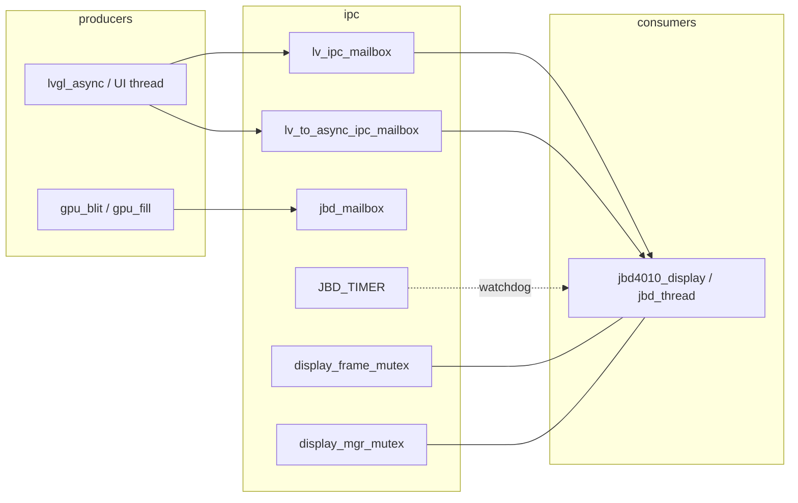
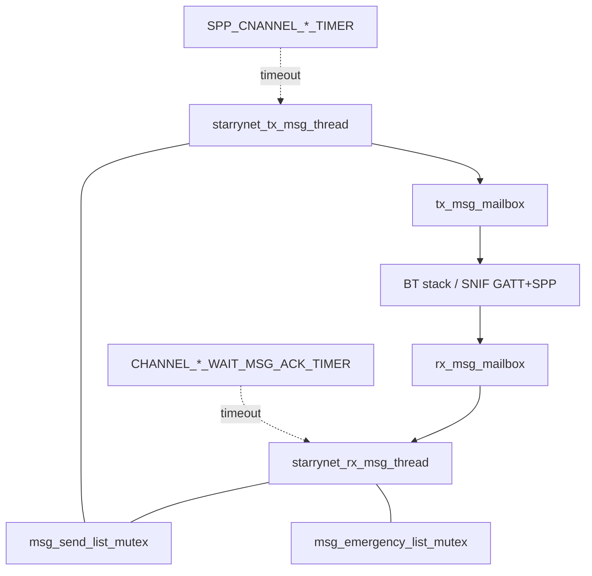
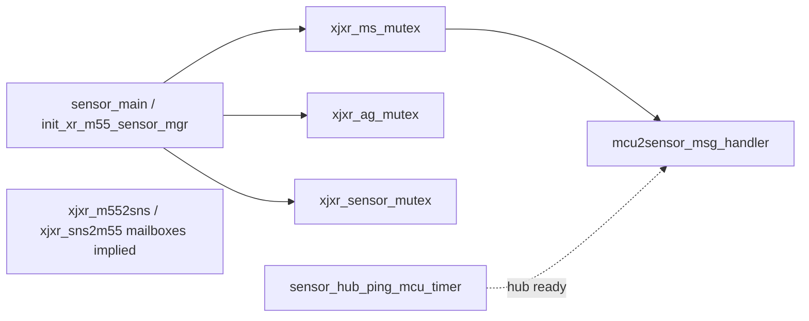
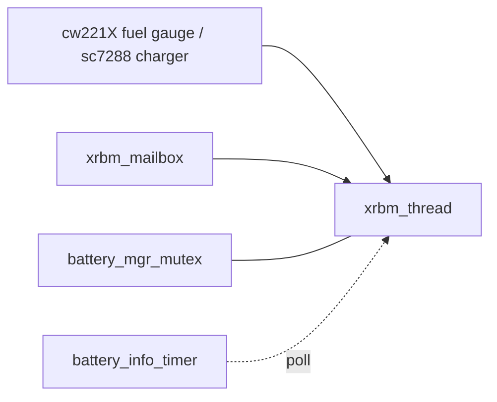
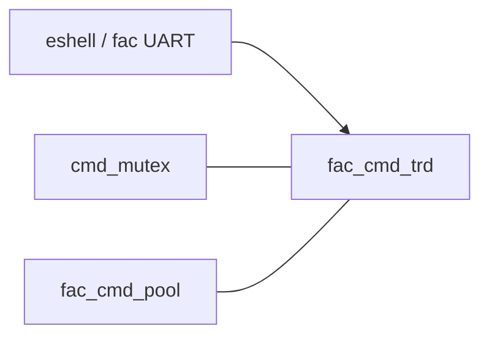

# M55 RTOS IPC Objects — platform_tester.bin 1.0.12.83

Leaf **1.1.2** inventory of recoverable inter-process communication primitives on the BES M55 application core. Kernel: **FreeRTOS 10.4.1** with **CMSIS-RTOS2** wrapper (`osMutex*`, `osSemaphore*`, `osMessageQueue*`, `osTimer*`, `osEventFlags*`).

| Artifact | Path |
|----------|------|
| Extraction script | [`extract_ipc.py`](extract_ipc.py) |
| Machine-readable inventory | [`ipc_inventory.json`](ipc_inventory.json) |
| Firmware source | `Reverse/firmware/x_1.0.12.83/platform_tester.bin` |
| Parent writeup | [`STAR_AIR_FULL_WRITEUP.md`](../../../STAR_AIR_FULL_WRITEUP.md) |

## Summary

- **Total entries:** 133 (minimum gate: 40)
- **By type:** timer: **48** | mutex: **47** | mailbox: **15** | semaphore: **9** | memory_pool: **4** | event_flags: **4** | message_queue: **4** | other: **2**
- **By subsystem:** other: **36** | starrynet: **20** | sensor: **18** | battery/xrbm: **13** | audio: **12** | touch: **10** | display: **9** | dsp: **6** | shell: **4** | lvgl: **3** | factory: **2**

Evidence is string-based: debug names, creation-failure logs, and co-located thread names within ±512 bytes in `.rodata`. Handle IDs (actual `osMutexId_t` values) live in `.bss`/SRAM and are **not** recovered here.

## CMSIS-RTOS2 APIs observed

```
  osEventFlagsClear
  osEventFlagsDelete
  osEventFlagsSet
  osEventFlagsWait
  osMessageQueueDelete
  osMessageQueueGet
  osMessageQueuePut
  osMessageQueueReset
  osMutexAcquire
  osMutexDelete
  osMutexRelease
  osSemaphoreAcquire
  osSemaphoreDelete
  osSemaphoreRelease
  osTimerDelete
  osTimerStart
  osTimerStop
```

Creation failure strings also reference `osSemaphoreNew`, `osMemoryPoolNew`, and FreeRTOS `xQueueCreateCountingSemaphore`.

---

## IPC flow diagrams

### Display path (JBD µLED + LVGL bridge)



Known thread names @ `0x424B0`: `jbd_thread`, `JBD_TIMER`, `jbd4010_display`, `jbd_mailbox`.

### StarryNet phone link (rx/tx split)



Failure strings: `Failed to Create starrynet rx thread`, `Failed to Create rx_msg_mailbox`, `Failed to Create tx msg mailbox`.

### Sensor hub bridge (M55 ↔ Sensor Hub MCU)



Documented in writeup: `xjxr_ms_mutex` @ `0x2C526A40` serializes bridge sends.

### Battery manager (xrbm)



Messages: USB plug (`0x20`), SOC refresh (`0x40`) per writeup.

### Factory command dispatch



---

## Inventory by subsystem

### display (9)

| Name | Type | File offset | Related threads |
|------|------|-------------|-----------------|
| `jbd_mailbox` | mailbox | `0x00042534` | `jbd4010_display`, `jbd_thread` |
| `lv_ipc_mailbox` | mailbox | `0x00424bf8` | `lvgl_async`, `assert_lvgl_ui_thread` |
| `lv_to_async_ipc_mailbox` | mailbox | `0x0041d760` | `lvgl_async`, `assert_lvgl_ui_thread` |
| `display_ctrl_mutex` | mutex | `0x0041f758` | `display_mgr`, `jbd4010_display` |
| `display_frame_mutex` | mutex | `0x00042520` | `display_mgr`, `jbd4010_display`, `jbd_thread` |
| `display_mgr_mutex` | mutex | `0x00039288` | `display_mgr`, `jbd4010_display` |
| `jbd_panel_sem` | semaphore | `0x00042200` | `jbd4010_display`, `jbd_thread` |
| `JBD_TIMER` | timer | `0x000424bc` | `jbd4010_display`, `jbd_thread` |
| `lv_ipc_timer` | timer | `0x00424b98` | `lvgl_async`, `assert_lvgl_ui_thread` |

### battery / xrbm (13)

| Name | Type | File offset | Related threads |
|------|------|-------------|-----------------|
| `xrbm_mailbox` | mailbox | `0x0003965c` | `xrbm_thread` |
| `battery_mgr_mutex` | mutex | `0x0003966c` | `xrbm_thread` |
| `ota_checker_mutex` | mutex | `0x000287d4` | `ota_checker` |
| `power_state_mutex` | mutex | `0x004264a4` | `xrbm_thread`, `battery_mgr`, `ota_checker` |
| `powerkey_mgr_mutex` | mutex | `0x000390e8` | `xrbm_thread`, `battery_mgr`, `ota_checker` |
| `xrm_mutex_psram` | mutex | `0x0002bcbc` | `xrbm_thread` |
| `xrm_mutex_sys` | mutex | `0x0002bccc` | `xrbm_thread` |
| `ota_checker_semaphore` | semaphore | `0x000286e4` | `ota_checker` |
| `pmu_semaphore` | semaphore | `0x00015828` | `xrbm_thread`, `battery_mgr`, `ota_checker` |
| `battery_info_timer` | timer | `0x00038bfc` | `xrbm_thread` |
| `dump_battery_info_timer` | timer | `0x000436cc` | `xrbm_thread` |
| `pmu_pwrkey_check_timer` | timer | `0x00015914` | `xrbm_thread`, `battery_mgr`, `ota_checker` |
| `start_batterystats_timer` | timer | `0x00041984` | `xrbm_thread` |

### starrynet (20)

| Name | Type | File offset | Related threads |
|------|------|-------------|-----------------|
| `rx_msg_mailbox` | mailbox | `0x0003294c` | `starrynet_rx_msg_thread`, `starrynet_tx_msg_thread` |
| `tx_msg_mailbox` | mailbox | `0x0003295c` | `starrynet_tx_msg_thread`, `starrynet_rx_msg_thread` |
| `app_msg_neg_fallback_mutex` | mutex | `0x0041a4e0` | `starrynet_rx_msg_thread`, `starrynet_tx_msg_thread`, `xr_starrynet_thread_start` |
| `app_msg_proxy_mutex` | mutex | `0x0003d3e0` | `starrynet_rx_msg_thread`, `starrynet_tx_msg_thread`, `xr_starrynet_thread_start` |
| `clear_device_info_mutex` | mutex | `0x000365d4` | `starrynet_rx_msg_thread`, `starrynet_tx_msg_thread`, `xr_starrynet_thread_start` |
| `device_name_mutex` | mutex | `0x000291e4` | `starrynet_rx_msg_thread`, `starrynet_tx_msg_thread`, `xr_starrynet_thread_start` |
| `init_clear_device_info_mutex` | mutex | `0x00036588` | `starrynet_rx_msg_thread`, `starrynet_tx_msg_thread`, `xr_starrynet_thread_start` |
| `msg_emergency_list_mutex` | mutex | `0x000333b0` | `starrynet_rx_msg_thread`, `starrynet_tx_msg_thread`, `xr_starrynet_thread_start` |
| `msg_send_list_mutex` | mutex | `0x000333cc` | `starrynet_rx_msg_thread`, `starrynet_tx_msg_thread`, `xr_starrynet_thread_start` |
| `xrrts_mutex` | mutex | `0x0003503c` | `starrynet_rx_msg_thread`, `starrynet_tx_msg_thread`, `xr_starrynet_thread_start` |
| `APP_MSG_NEG_FALLBACK_TIMER` | timer | `0x0041a400` | `starrynet_rx_msg_thread`, `starrynet_tx_msg_thread`, `xr_starrynet_thread_start` |
| `CHANNEL_RECV_WAIT_MSG_ACK_TIMER` | timer | `0x00032b04` | `starrynet_rx_msg_thread`, `starrynet_tx_msg_thread`, `xr_starrynet_thread_start` |
| `CHANNEL_SEND_WAIT_MSG_ACK_TIMER` | timer | `0x00032b24` | `starrynet_rx_msg_thread`, `starrynet_tx_msg_thread`, `xr_starrynet_thread_start` |
| `IOS_CTKD_BOND_TIMER` | timer | `0x00031790` | `starrynet_rx_msg_thread`, `starrynet_tx_msg_thread`, `xr_starrynet_thread_start` |
| `SPP_CNANNEL_CONN_TIMER` | timer | `0x00032ff0` | `starrynet_rx_msg_thread`, `starrynet_tx_msg_thread`, `xr_starrynet_thread_start` |
| `SPP_CNANNEL_MSG_RECV_TIMER` | timer | `0x00033008` | `starrynet_rx_msg_thread`, `starrynet_tx_msg_thread`, `xr_starrynet_thread_start` |
| `UPDATE_ADV_DATA_TIMER` | timer | `0x00035208` | `starrynet_rx_msg_thread`, `starrynet_tx_msg_thread`, `xr_starrynet_thread_start` |
| `WAIT_EMERGENCY_MSG_ACK_TIMER` | timer | `0x00032254` | `starrynet_rx_msg_thread`, `starrynet_tx_msg_thread`, `xr_starrynet_thread_start` |
| `WAIT_EXTERNAL_MSG_ACK_TIMER` | timer | `0x00032274` | `starrynet_rx_msg_thread`, `starrynet_tx_msg_thread`, `xr_starrynet_thread_start` |
| `start_spp_conn_timer` | timer | `0x00033164` | `starrynet_rx_msg_thread`, `starrynet_tx_msg_thread`, `xr_starrynet_thread_start` |

### factory (2)

| Name | Type | File offset | Related threads |
|------|------|-------------|-----------------|
| `fac_cmd_pool` | memory_pool | `0x0015fd88` | `fac_cmd_trd` |
| `cmd_mutex` | mutex | `0x0015fd7c` | `fac_cmd_trd` |

### touch (10)

| Name | Type | File offset | Related threads |
|------|------|-------------|-----------------|
| `stk_alg_work_queue` | message_queue | `0x00045fb4` | `touch_trd`, `touch_job_thread`, `stk_touch_trd` |
| `stk_phase_reset_queue` | message_queue | `0x00045f9c` | `touch_trd`, `touch_job_thread`, `stk_touch_trd` |
| `stk_work_queue` | message_queue | `0x000450f8` | `touch_trd`, `touch_job_thread`, `stk_touch_trd` |
| `xjxr_tp_mutex` | mutex | `0x0042068c` | `touch_trd`, `touch_job_thread` |
| `STK501XX_FAR_CHECK_TIMER` | timer | `0x00148c44` | `touch_trd`, `touch_job_thread`, `stk_touch_trd` |
| `STK501XX_TRACE_DATA_TIMER` | timer | `0x00148bfc` | `touch_trd`, `touch_job_thread`, `stk_touch_trd` |
| `STK501XX_WEAR_DAEMON_TIMER` | timer | `0x00148c28` | `wear_detect_handler`, `sensor_main`, `stk501xx_cust_thread` |
| `stk51155_4pad_timer` | timer | `0x00044324` | `touch_trd`, `touch_job_thread`, `stk_touch_trd` |
| `stk51155_create_and_start_timer` | timer | `0x000450c0` | `touch_trd`, `touch_job_thread`, `stk_touch_trd` |
| `stk51155_timer` | timer | `0x00044fb4` | `touch_trd`, `touch_job_thread`, `stk_touch_trd` |

### audio (12)

| Name | Type | File offset | Related threads |
|------|------|-------------|-----------------|
| `a2dp_sink_player_mailbox` | mailbox | `0x00164aa4` | `a2dp_sink_player_thread` |
| `app_audio_focus_state_mutex` | mutex | `0x0003f4e7` | `xjxr_audio_msg_handler_thread`, `af_thread` |
| `audio_req_mutex` | mutex | `0x0003f760` | `xjxr_audio_msg_handler_thread`, `af_thread` |
| `audio_rpc0_mutex` | mutex | `0x0003d7e8` | `xjxr_audio_msg_handler_thread`, `af_thread` |
| `audio_rpc1_mutex` | mutex | `0x0003d7fc` | `xjxr_audio_msg_handler_thread`, `af_thread` |
| `audio_rpc_seq_mutex` | mutex | `0x0003d810` | `rpc_rx_thread`, `xjxr_audio_msg_handler_thread`, `af_thread` |
| `audio_test_pcmbuff_mutex` | mutex | `0x0003d0a0` | `xjxr_audio_msg_handler_thread`, `af_thread` |
| `audioflinger_mutex` | mutex | `0x0014e4e0` | `xjxr_audio_msg_handler_thread`, `a2dp_sink_player_thread`, `af_thread` |
| `aw_smartpa_mutex` | mutex | `0x0004cc58` | `xjxr_audio_msg_handler_thread`, `a2dp_sink_player_thread`, `af_thread` |
| `lyric_mutex` | mutex | `0x00184e3c` | `xjxr_audio_msg_handler_thread`, `a2dp_sink_player_thread`, `af_thread` |
| `pause_music_mutex` | mutex | `0x00186c84` | `xjxr_audio_msg_handler_thread`, `a2dp_sink_player_thread`, `af_thread` |
| `player_state_mutex` | mutex | `0x0003e48c` | `xjxr_audio_msg_handler_thread`, `a2dp_sink_player_thread`, `af_thread` |

### sensor (18)

| Name | Type | File offset | Related threads |
|------|------|-------------|-----------------|
| `sar_mailbox` | mailbox | `0x00046060` | `sar_thread`, `sar_thread_51155`, `sar_thread_51158` |
| `sar_mailbox_51155` | mailbox | `0x000451ec` | `sar_thread`, `sar_thread_51155`, `sar_thread_51158` |
| `sar_mailbox_51155_4pad` | mailbox | `0x000443a8` | `sar_thread`, `sar_thread_51155`, `sar_thread_51158` |
| `sar_mailbox_51158` | mailbox | `0x00043c70` | `sar_thread`, `sar_thread_51155`, `sar_thread_51158` |
| `wear_input_mutex` | mutex | `0x0042004c` | `wear_detect_handler`, `sensor_main` |
| `wear_policy_mutex` | mutex | `0x00420060` | `wear_detect_handler`, `sensor_main` |
| `xjxr_ag_mutex` | mutex | `0x00038f54` | `sensor_main`, `mcu2sensor_msg_handler` |
| `xjxr_ms_mutex` | mutex | `0x00041cc8` | `mcu2sensor_msg_handler`, `sensor_main` |
| `xjxr_sensor_mutex` | mutex | `0x001477fc` | `sensor_main`, `mcu2sensor_msg_handler` |
| `SAR_TIMER` | timer | `0x00045da8` | `sensor_main`, `sar_thread`, `sar_thread_51155` |
| `SAR_TIMER_51155` | timer | `0x00044f90` | `sensor_main`, `sar_thread`, `sar_thread_51155` |
| `SAR_TIMER_51155_4pad` | timer | `0x000442f0` | `sensor_main`, `sar_thread`, `sar_thread_51155` |
| `SAR_TIMER_51158` | timer | `0x00043bf4` | `sensor_main`, `sar_thread`, `sar_thread_51155` |
| `sensor_hub_ping_mcu_timer` | timer | `0x00147600` | `sensor_main`, `sar_thread`, `sar_thread_51155` |
| `stk5115_alg_timer` | timer | `0x00045d88` | `sensor_main`, `sar_thread`, `sar_thread_51155` |
| `stk5115_phase_timer` | timer | `0x00045d74` | `sensor_main`, `sar_thread`, `sar_thread_51155` |
| `stk5115_stk_timer` | timer | `0x00045d60` | `sensor_main`, `sar_thread`, `sar_thread_51155` |
| `stk5115_wdt_timer` | timer | `0x00045d4c` | `sensor_main`, `sar_thread`, `sar_thread_51155` |

### shell (4)

| Name | Type | File offset | Related threads |
|------|------|-------------|-----------------|
| `app_eshell_cmd_done_signal_wait` | event_flags | `0x00429cc0` | `eshell_rpc_rx_thread`, `aslt_thread` |
| `aslt_mailbox` | mailbox | `0x00038084` | `eshell_rpc_rx_thread`, `aslt_thread` |
| `trace_send_mutex` | mutex | `0x00427660` | `eshell_rpc_rx_thread`, `aslt_thread`, `restart_eshell_thread` |
| `ESHELL_SLEEP_TIMER` | timer | `0x0015fbfc` | `eshell_rpc_rx_thread`, `aslt_thread`, `fac_cmd_trd` |

### dsp (6)

| Name | Type | File offset | Related threads |
|------|------|-------------|-----------------|
| `app_core_bridge_tx_mailbox` | mailbox | `0x001472c8` | `core_bridge_tx_thread`, `core_bridge_rx_thread` |
| `bth_if_client_mailbox` | mailbox | `0x001640bc` | `bth_if_client_thread` |
| `rpc_rx_mailbox` | mailbox | `0x00163468` | `rpc_rx_thread`, `bth_dsp_tx_thread` |
| `app_core_bridge_tx_mutex` | mutex | `0x001472ac` | `core_bridge_tx_thread`, `core_bridge_rx_thread` |
| `bth_if_client_comm_sem` | semaphore | `0x00163e84` | `bth_if_client_thread` |
| `mcpp_cmd_sema` | semaphore | `0x000b08bc` | `mcpp_srv_thread` |

### lvgl (3)

| Name | Type | File offset | Related threads |
|------|------|-------------|-----------------|
| `lv_startup_sync_sem` | semaphore | `0x0003d2c4` | `lvgl_async`, `assert_lvgl_ui_thread` |
| `lvgl_async_handler_sem` | semaphore | `0x0041d8a8` | `lvgl_async`, `assert_lvgl_ui_thread` |
| `lvgl_os_tick_timer` | timer | `0x0041dad0` | `lvgl_async`, `assert_lvgl_ui_thread` |

### other (36)

| Name | Type | File offset | Related threads |
|------|------|-------------|-----------------|
| `SHARE_STREAM_TYPE__SIGNAL` | event_flags | `0x0002cfa0` | — |
| `bt_signal_strength` | event_flags | `0x00037664` | — |
| `wifi_signal_strength` | event_flags | `0x0003764c` | — |
| `os_memory_pool` | memory_pool | `0x001607a0` | — |
| `smf_get_pool` | memory_pool | `0x000d9b14` | — |
| `smf_set_pool` | memory_pool | `0x000d9b21` | — |
| `generic_msg_queue` | message_queue | `0x0016157c` | — |
| `nv_mutex` | mutex | `0x00161014` | — |
| `postion_mutex` | mutex | `0x00184e2c` | — |
| `quick_start_mutex` | mutex | `0x0042015c` | — |
| `ring_manager_mtx` | mutex | `0x0003d3f4` | — |
| `rx_cmd_queue_mutex` | mutex | `0x00429ce0` | `eshell_rpc_rx_thread` |
| `rx_result_queue_mutex` | mutex | `0x00429cf4` | `eshell_rpc_rx_thread` |
| `xjxr_common_system_sleep_mutex` | mutex | `0x00041764` | — |
| `xjxr_mltc_mutex` | mutex | `0x001635b0` | `rpc_rx_thread` |
| `xjxr_wd_mutex` | mutex | `0x000397e8` | `wear_detect_handler`, `sensor_main`, `xrbm_thread` |
| `xr_user_data_mutex` | mutex | `0x0002b84c` | — |
| `create_phase_reset_timer` | other | `0x00045f00` | `sar_thread`, `stk_touch_trd` |
| `create_stk_timer` | other | `0x00045eec` | `sar_thread`, `stk_touch_trd` |
| `WAIT_SEM` | semaphore | `0x00149590` | — |
| `generic_semaphore` | semaphore | `0x0041da5c` | — |
| `APP_PING_BTH_CONN_TIMER` | timer | `0x0003d3a8` | — |
| `BATTERSTATS_TIMER` | timer | `0x00041a4c` | — |
| `OTA_TRANSFER_TIMEOUT_TIMER` | timer | `0x00183d24` | — |
| `PING_CIRCLE_JSON_TIMER` | timer | `0x000410f8` | — |
| `SYSTEM_SLEEP_AGAIN_TIMER` | timer | `0x00041748` | — |
| `cpu_usage_timer` | timer | `0x00427f24` | — |
| `deferred_init_timer` | timer | `0x00148efc` | — |
| `dump_uart_timer` | timer | `0x0014d164` | — |
| `init_delay_timer` | timer | `0x0018bf40` | — |
| `ota_start_transfer_timeout_timer` | timer | `0x00182d5c` | — |
| `ota_stop_transfer_timeout_timer` | timer | `0x00182ce4` | — |
| `reset_message_timer` | timer | `0x00190978` | — |
| `wakeup_timer` | timer | `0x0012d7d8` | — |
| `wdt_ping_timer` | timer | `0x0016371c` | — |
| `xjxr_sleep_confirm_timer` | timer | `0x0004172c` | — |


---

## Known thread ↔ IPC cross-reference

| Thread name | Primary IPC objects | Subsystem |
|-------------|---------------------|-----------|
| `jbd4010_display` / `jbd_thread` | `jbd_mailbox`, `JBD_TIMER`, `display_frame_mutex` | display |
| `xrbm_thread` | `xrbm_mailbox`, `battery_mgr_mutex`, `battery_info_timer` | battery/xrbm |
| `starrynet_rx_msg_thread` | `rx_msg_mailbox`, `msg_send_list_mutex` | starrynet |
| `starrynet_tx_msg_thread` | `tx_msg_mailbox`, `msg_send_list_mutex` | starrynet |
| `fac_cmd_trd` | `cmd_mutex`, `fac_cmd_pool` | factory |
| `touch_trd` / `stk_touch_trd` | `xjxr_tp_mutex`, `stk_work_queue` | touch |
| `xjxr_audio_msg_handler_thread` | `audioflinger_mutex`, `audio_req_mutex`, `a2dp_sink_player_mailbox` | audio |
| `sensor_main` / `mcu2sensor_msg_handler` | `xjxr_ms_mutex`, `xjxr_ag_mutex`, `sar_mailbox` | sensor |
| `rpc_rx_thread` | `rpc_rx_mailbox`, `audio_rpc_seq_mutex` | dsp |
| `lvgl_async` | `lv_ipc_mailbox`, `lv_startup_sync_sem`, `lvgl_os_tick_timer` | lvgl |
| `eshell_rpc_rx_thread` / `aslt_thread` | `aslt_mailbox`, `trace_send_mutex` | shell |

---

## Regeneration

```bash
python3 Reverse/firmware/analysis/rtos/m55/extract_ipc.py
```

Optional custom firmware path:

```bash
python3 extract_ipc.py /path/to/platform_tester.bin
```
