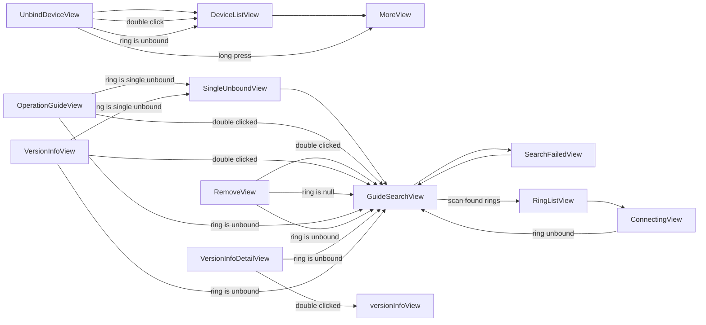

# On-glasses UI navigation flow — extracted from ui_names.txt (1.0.12.83)

**37 Views, 5 Pages, 22 navigation transitions.**

## Navigation transitions (trigger: From -> To)

| trigger | from | to |
|---|---|---|
| ring unbound | `ConnectingView` | `GuideSearchView` |
| (default) | `DeviceListView` | `MoreView` |
| scan found rings | `GuideSearchView` | `RingListView` |
| (default) | `GuideSearchView` | `SearchFailedView` |
| double clicked | `OperationGuideView` | `GuideSearchView` |
| ring is unbound | `OperationGuideView` | `GuideSearchView` |
| ring is single unbound | `OperationGuideView` | `SingleUnboundView` |
| double clicked | `RemoveView` | `GuideSearchView` |
| ring is null | `RemoveView` | `GuideSearchView` |
| ring is unbound | `RemoveView` | `GuideSearchView` |
| (default) | `RingListView` | `ConnectingView` |
| (default) | `SearchFailedView` | `GuideSearchView` |
| (default) | `SingleUnboundView` | `GuideSearchView` |
| (default) | `UnbindDeviceView` | `DeviceListView` |
| double click | `UnbindDeviceView` | `DeviceListView` |
| ring is unbound | `UnbindDeviceView` | `DeviceListView` |
| long press | `UnbindDeviceView` | `MoreView` |
| ring is unbound | `VersionInfoDetailView` | `GuideSearchView` |
| double clicked | `VersionInfoDetailView` | `versionInfoView` |
| double clicked | `VersionInfoView` | `GuideSearchView` |
| ring is unbound | `VersionInfoView` | `GuideSearchView` |
| ring is single unbound | `VersionInfoView` | `SingleUnboundView` |

## Mermaid graph

## All Views (37):

`AboutView`, `AddressView`, `AirMusicView`, `BrightView`, `ButtonView`, `CommView`, `ConnectingView`, `DeviceListView`, `EndView`, `FontView`, `GuideSearchView`, `IdleView`, `LanguageView`, `LaunchFailedView`, `LaunchView`, `LauncherView`, `ModeView`, `MoreView`, `NaviView`, `OperationGuideView`, `PhoneView`, `PowerOffAndRebootView`, `RemoveView`, `RingListView`, `ScheduleDomainView`, `ScreenOffView`, `SearchFailedView`, `SettingView`, `SingleUnboundView`, `StateView`, `TodoDomainView`, `TransView`, `UnbindDeviceView`, `VersionInfoDetailView`, `VersionInfoView`, `VolView`, `WearView`

## All Pages (5):

`DialYellowPage`, `MMIPage`, `PhonePage`, `StartPage`, `SwitchPage`
