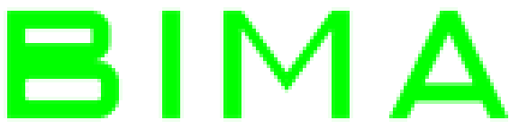

# BIMA wordmark — 1.0.11.53

Replaces the power-off logotype. **Pure data**: only the 2,592 bytes of pixel payload
change. Descriptor, palette, every instruction and the image length are byte-identical
to stock. This is the safest patch tier in the project — strictly safer than no-rings,
which at least altered an operand a live instruction reads.

|  | |
|---|---|
| stock |  |
| patched |  |

Both images above are decoded **out of the firmware** with the firmware's own palette,
not from the source art — so they are what the panel resolves, not what was intended.

## Where it lives

```
descriptor  file 0x413450   cf=9  144x36  data_size=2656  data=0x3C3EB140
data        file 0x413490   [64 B palette][2592 B pixels]
pixels      file 0x4134D0
```

## The trap: the data delta is PER BUILD

```
1.0.12.83   file = VA - 0x3BFD7C0C     <- the constant in CLAUDE.md
1.0.11.53   file = VA - 0x3BFD7CB0     <- this build, 164 bytes apart
```

Using 12.83's constant here lands 164 bytes late. You get an all-zero palette and a
bitmap shifted ~2.3 rows — which **still renders as a recognisable wordmark**, so it
looks almost right. `make_wordmark.py` refuses unless the 64 bytes it finds are a real
alpha ramp, and `verify-wordmark.mjs` asserts the two constants disagree.

## The panel is monochrome green

Every palette entry is the same green with only alpha climbing (0, 16, 32 … 255), so
the 4 bits are an alpha level, not a colour. A replacement is just an anti-aliased
mask; there is no colour to pick, and quantising means nearest-alpha (the ramp is not
linear at the top: …191, 222, 239, 255).

## Rebuild

```sh
python3 Tools/fwbuilder/make_wordmark.py \
    Reverse/firmware/x_1.0.11.53/platform_tester.bin \
    Reverse/firmware/patched_wordmark/1.0.11.53/platform_tester.bin
node Tools/fwbuilder/verify-wordmark.mjs "$PWD"      # 29 gates
```

`--text`, `--stroke`, `--tracking` and `--widths` are all settable; the drawing routine
carries glyphs for B, I, M and A only, and refuses anything else rather than guessing.

## Status

Flashable, **not yet confirmed on hardware**.
